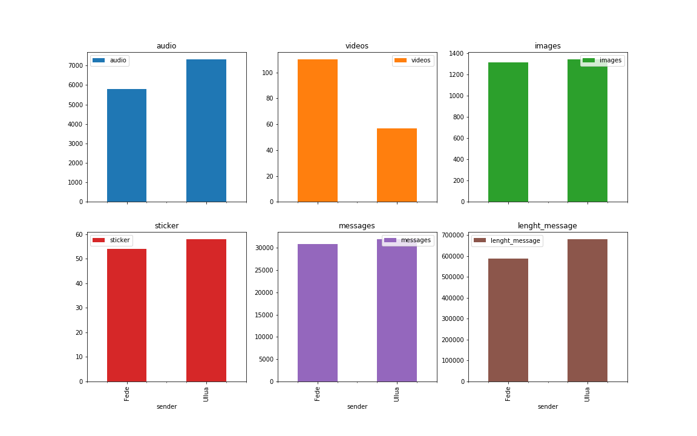

# Whatsapp Chat Analyzer

Whatsapp Chat Analyzer is a python program that takes as input a .txt chat log from whatsapp and spits out some relevant information about chat patterns. This works best for iOS phones set to english.

# Usage

In whatsapp, go to the chat you care about, click on the top menu and scroll down to export chat. You can send the chat log(without media) to an email address. After that you simply put in in the same folder as the script and adjust the name in the script.

# Results

The scripts returns a series of graphics with the relevant data.

In the six graphs above, you can see who of the two sent the most images, audios, videos, messages, etc.

While in the next following graphs you can see more relevant information, such as time information. What time was the busiest, what month, what day, etc.

